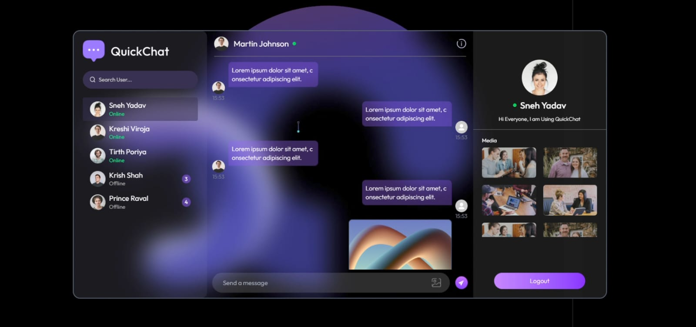

<h1 align="center">💬 Quick Chat App</h1>

<p align="center">
  <b>A modern, full-stack real-time chat application</b><br>
  <i>Connect, chat, and share instantly with friends and colleagues.</i>
</p>

<p align="center">
  
  
  
  
  

</p>

---

<p align="center">
  
</p>

## 🌎 Live Preview

<p align="center">
  <a href="https://chat-app-pi-peach-74.vercel.app/" target="_blank">
    
  </a>
</p>

---

## 🚀 Features

- 🔒 **Secure Authentication** — JWT-based signup & login
- 💬 **Real-Time Messaging** — Powered by Socket.IO
- 🟢 **Online Status** — See who’s online instantly
- 🖼️ **Profile & Media Sharing** — Upload avatars & share images in chat
- 📱 **Responsive Design** — Works beautifully on desktop & mobile
- 🔔 **Unread Message Badges** — Never miss a message
- ☁️ **Cloudinary Integration** — Fast & reliable media storage

---

## 🛠️ Tech Stack

| Frontend     | Backend          | Database | Real-Time | Media Storage |
| ------------ | ---------------- | -------- | --------- | ------------- |
| React, Vite  | Node.js, Express | MongoDB  | Socket.IO | Cloudinary    |
| Tailwind CSS | JWT Auth         | Mongoose |           |               |

---

## ⚡ Getting Started

<details>
<summary><b>1. Clone the Repository</b></summary>

```sh
git clone https://github.com/Sneh0510/Chat-App.git
cd CHAT-APP
```

</details>

<details>
<summary><b>2. Install Dependencies</b></summary>

```sh
cd server && npm install
cd ../client && npm install
```

</details>

<details>
<summary><b>3. Configure Environment Variables</b></summary>

- <b>Server (<code>server/.env</code>):</b>

  ```
  MONGODB_URI=your_mongodb_connection_string
  PORT=5000
  JWT_SECRET=your_jwt_secret
  CLOUDINARY_CLOUD_NAME=your_cloudinary_name
  CLOUDINARY_API_KEY=your_cloudinary_api_key
  CLOUDINARY_API_SECRET=your_cloudinary_api_secret
  ```

- <b>Client (<code>client/.env</code>):</b>
  ```
  VITE_BACKEND_URL='http://localhost:5000'
  ```
  </details>

<details>
<summary><b>4. Run the App Locally</b></summary>

- <b>Frontend:</b>
  ```sh
  cd client
  npm run dev
  ```
- <b>Backend:</b>
  ```sh
  cd server
  npm run server
  ```

Visit [http://localhost:5173](http://localhost:5173) in your browser.

</details>

---

## 🌐 Deployment

- Ready for deployment on **Vercel** (see `vercel.json` in each folder).
- Configure environment variables in your deployment dashboard.

---

## 📄 License

This project is licensed under the [MIT License](./LICENSE).

---

<p align="center">  </p>
